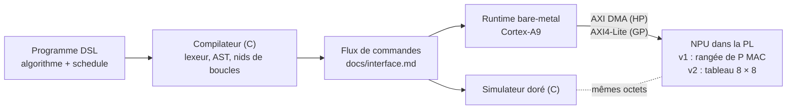

# zynq-npu

Un NPU int8 en SystemVerilog, et le générateur de kernels qui le programme, sur ZedBoard (Zynq-7020).

[](https://github.com/Quentin0l/zynq-npu/actions/workflows/ci.yml)

Un GEMM INT8 s'écrit dans un petit DSL qui sépare **l'algorithme**, ce que l'on calcule, du **schedule** : comment on le découpe en tuiles, et dans quel ordre. Le compilateur, écrit en C, abaisse le programme en nids de boucles, puis émet un flux de commandes. Le Cortex-A9 l'envoie au NPU par DMA, et le NPU le calcule dans la logique programmable. Un simulateur en C sert de référence dorée : le RTL doit lui donner raison au bit près.



## Le NPU

**v1, le moteur matrice-vecteur** (`rtl/moteur/`). C'est une rangée de P MAC int8 → int32, output-stationary, avec :
- un tampon de poids en BRAM, dont chaque mot donne un poids à chaque MAC ;
- une unité de requantification int32 → int8, ReLU comprise ;
- un séquenceur, une machine d'états qui exécute seule une couche entière, passe après passe.

Chaque brique a son banc cocotb et ses mutants. En simulation, le moteur exécute un MLP complet, 512 → 256 → 128 → 64 → 10, d'int8 à int8, sans que le banc intervienne entre deux couches.

**v2, le tableau systolique 8 × 8** (`rtl/tableau/`). Il calcule un GEMM par tuiles de 8 × 8, avec 64 MAC et des données qui ne voyagent qu'entre PE voisins. Le PE et le tableau existent déjà ; le décalage d'entrée et le contrôleur sont en cours. Il se branchera derrière le même contrat d'interface que la v1.

## Le même GEMM, en OpenCL

`opencl/` exécute le GEMM int8 → int32 sur un device OpenCL : le GPU d'un Mac par l'OpenCL d'Apple, ou le CPU par [PoCL](https://portablecl.org/) en CI. L'hôte est en C++17, construit avec CMake, au-dessus d'une fine surcouche RAII de l'API C. Les kernels, en OpenCL C, sont un naïf (un work-item par case de C) et un tuilé en mémoire locale. Les résultats sont vérifiés au bit près contre la référence de `ref/`. C'est une troisième cible pour le même calcul, à côté du C et du NPU, et un futur back-end du générateur de kernels.

## Où en est le projet

Huit semaines, du 5 octobre au 29 novembre 2026. Chaque semaine est un [jalon](https://github.com/Quentin0l/zynq-npu/milestones) ; le récit est dans le [journal](JOURNAL.md).

| Semaine | Objectif | État |
|---|---|---|
| [S1](https://github.com/Quentin0l/zynq-npu/milestone/1) · 5 au 11 oct. | Figer les deux contrats, finir le NPU | 🚧 |
| [S2](https://github.com/Quentin0l/zynq-npu/milestone/2) · 12 au 18 oct. | Premier GEMM sur le NPU, premières commandes du compilateur | ⏳ |
| [S3](https://github.com/Quentin0l/zynq-npu/milestone/3) · 19 au 25 oct. | Le simulateur doré et la co-simulation | ⏳ |
| [S4](https://github.com/Quentin0l/zynq-npu/milestone/4) · 26 oct. au 1er nov. | Sur la carte | ⏳ |
| [S5](https://github.com/Quentin0l/zynq-npu/milestone/5) · 2 au 8 nov. | Le schedule devient un paramètre | ⏳ |
| [S6](https://github.com/Quentin0l/zynq-npu/milestone/6) · 9 au 15 nov. | Les chiffres, dont le duel NEON contre NPU | ⏳ |
| [S7](https://github.com/Quentin0l/zynq-npu/milestone/7) · 16 au 22 nov. | Modèle de coût et autotuner | ⏳ |
| [S8](https://github.com/Quentin0l/zynq-npu/milestone/8) · 23 au 29 nov. | Montrer | ⏳ |

## Le dépôt

| Dossier | Contenu |
|---|---|
| `rtl/moteur/` | NPU v1 : MAC, rangée, tampon de poids, moteur de passe, requantification, séquenceur, couche |
| `rtl/tableau/` | NPU v2 : PE, tableau systolique, décalages d'entrée |
| `tb/` | Bancs cocotb + Verilator, modèles Python au bit près, mutants |
| `ref/` | GEMM de référence en C : naïf, et parcouru selon un schedule |
| `opencl/` | Le GEMM en OpenCL : hôte C++17 et CMake, kernels naïf et tuilé |
| `compiler/` | Le compilateur du DSL, en C (aujourd'hui : le lexeur) |
| `docs/` | Le contrat d'interface, la grammaire du DSL, le journal des bugs, les notes de lecture |

À venir : `sim/`, le simulateur doré (S3) ; `runtime/`, le code du Cortex-A9 (S2, S4) ; `bench/`, les mesures (S6, S7).

## Lancer les tests

Il faut Verilator 5.036 ou plus récent, Python 3 et un compilateur C.

```sh
python3 -m venv .venv && .venv/bin/pip install -r requirements.txt
make test
```

`make test` vérifie ce qui est fini : le lexeur et le NPU v1. Le reste se lance à part : `tb/check.sh v2` pour le tableau, `ref/check.sh` pour les GEMM en C, `opencl/check.sh` pour OpenCL (avec CMake et une implémentation d'OpenCL), ou une seule suite, comme `tb/check.sh couche`. La CI affiche aussi les travaux en cours, sans qu'ils la bloquent.

**Des mutants pour juger les tests.** Chaque banc tourne d'abord sur le RTL, puis sur des copies où un bug a été planté (`tb/mutants/`). Si un mutant survit, il manque un test.

## La cible

ZedBoard, XC7Z020 : 53 200 LUT, 106 400 bascules, 220 DSP48E1, 140 BRAM de 36 Kb ; deux Cortex-A9 à 667 MHz ; quatre ports AXI HP de 64 bits vers 512 Mo de DDR3. Le moteur v1 occupe un DSP par MAC : P = 8 dans les bancs, et jusqu'à 220 sur la puce. Le tableau v2 en occupe 64.

## Conventions

SystemVerilog aux conventions ISMIN (Mines Saint-Étienne) : suffixes `_i`, `_o`, `_s`, `_g`, reset asynchrone actif bas `resetb_i`, blocs nommés. Code et documentation en français.

## Provenance

Projet personnel, mené avec un parcours d'apprentissage guidé par une IA (Claude, d'Anthropic) : leçons, squelettes d'exercices et outils de vérification. Les fichiers fournis en tout ou en partie par ce parcours le disent dans leur en-tête.
